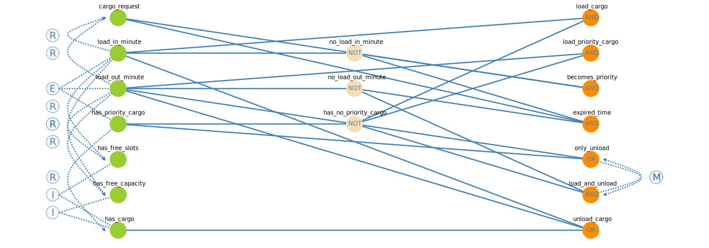

# Test Documentation - Cart Controller in a factory

## 1. CEG graph and the resulting decision table ##

- the [directory](./ceg_testos) contains a generated [graph](./ceg_testos/graph.svg), a decision [table](./ceg_testos/test_cases.csv) with generated test cases, and a [report](./ceg_testos/report.md) of settings and results.

|Causes && Effects  |Description                                                     |[1]  |[2]  |[3]  |[4]  |[5]  |[6]  |[7]  |[8]  |[9]  |[10] |[11] |[12] |[13] |[14] |
|-------------------|----------------------------------------------------------------|-----|-----|-----|-----|-----|-----|-----|-----|-----|-----|-----|-----|-----|-----|
|cargo_request      |Vznik požiadavky na presun materiálu z jedného miesta do druhého|1    |0    |1    |0    |1    |0    |1    |0    |1    |0    |0    |1    |1    |1    |
|load_in_minute     |Vozík si materiál vyzdvihne do 1 minúty od vzniku požiadavky    |1    |0    |0    |0    |0    |0    |0    |0    |0    |0    |0    |0    |0    |0    |
|load_out_minute    |Vozík si materiál vyzdvihne po 1 minúte od vzniku požiadavky    |0    |0    |1    |0    |0    |0    |0    |0    |1    |0    |0    |0    |0    |0    |
|has_priority_cargo |Vozík má naložený prioritný materiál                            |0    |0    |0    |0    |0    |0    |0    |0    |0    |0    |0    |1    |1    |0    |
|has_free_slots     |Vozík ma voľný dostatočný počet slotov vozíka                   |1    |1    |1    |1    |1    |0    |0    |0    |1    |1    |1    |1    |0    |0    |
|has_free_capacity  |Vozík má voľnú dostatočnú kapacitu                              |1    |1    |1    |0    |0    |0    |0    |1    |1    |1    |0    |1    |1    |1    |
|has_cargo          |Vozík má naložený materiál                                      |0    |0    |0    |0    |0    |0    |0    |0    |1    |1    |1    |1    |1    |0    |
|load_cargo         |Vozík vyzdvihne materiál                                        |true |false|false|false|false|false|false|false|false|false|false|false|false|false|
|load_priority_cargo|Vozík vyzdvihne prioritný materiál                              |false|false|true |false|false|false|false|false|true |false|false|false|false|false|
|becomes_priority   |Materiál sa stáva prioritným                                    |false|false|true |false|true |false|true |false|true |false|false|true |true |true |
|expired_time       |Vozík nestihol vyzdvihnúť náklad v požadovanom limite           |false|false|false|false|true |false|true |false|false|false|false|true |true |true |
|only_unload        |Vozík je v režíme iba_vykládka                                  |false|false|true |false|false|false|false|false|true |false|false|true |true |false|
|load_and_unload    |Vozík je v režíme nákladka_výkladka                             |true |true |false|true |true |true |true |true |false|true |true |false|false|true |
|unload_cargo       |Vozík vykladá už vyzdvihnuté materiály                          |true |false|true |false|false|false|false|false|true |true |true |true |true |false|

## 2. Identification of input testing parameters ##

| Parameter         | Description                                                    |
--------------------|-----------------------------------------------------------------
| src               | A source place of the cargo request.                           |
| dst               | A target place of the cargo request.                           |
| slots             | A number of cart's slots.                                      |
| capacity          | A maximum load capacity of the cart.                           |
| total weight      | Total weight of cargo requests loaded on the cart in one run.  |
| transport time    | A transport time of the cargo request from src to dst place.   |
| can load          | A flag indicating whether the cart can load the cargo request. |
| time to load      | A time to load the cargo request from its inception.           |
| time to station   | A time until the cart reaches the request source station.      |

## 3. Description of parameter characteristics ##

| src  | an available source place of the cargo request |
| ---: | :--------------------------------------------: |
| 1 | A |
| 2 | B |
| 3 | C |
| 4 | D |

| dst  | an available destination place of the cargo request |
| ---: | :-------------------------------------------------: |
| 1 | A |
| 2 | B |
| 3 | C |
| 4 | D |

| slots  | a possible number of cart's slots |
| -----: | :---------------------------------: |
| 1 | 1 |
| 2 | 2 |
| 3 | 3 |
| 4 | 4 |

| capacity  | a possible maximum load capacity of the cart |
| --------: | :------------------------------------------: |
| 1 | 50    |
| 2 | 150   |
| 3 | 500   |

| total_weight   | an interval of the total weight of all cargo requests |
| -------------: | :---------------------------------------------------: |
| 1 | (0, 50]    |
| 2 | (50, 150]  |
| 3 | (150, 500] |
| 4 | (500, inf) |

| transport_time  | an interval of transport time of cargo from source to destination |
| --------------: | :---------------------------------------------------------------: |
| 1 | (0, 10]     |
| 2 | (10, 20]    |
| 3 | (20, 30]    |
| 4 | (30, 40]    |
| 5 | (40, 50]    |
| 6 | (50, 60]    |
| 7 | (60, inf)   |

- capacity.1 -> !slots.1
- capacity.3 -> (slots.1 or slots.2)
- capacity.1 -> (total_weight.1 or total_weight.2)
- capacity.2 -> (total_weight.2 or total_weight.3)
- capacity.3 -> (total_weight.3 or total_weight.4)
- src.1 -> !dst.1
- src.2 -> !dst.2
- src.3 -> !dst.3
- src.4 -> !dst.4
- (src.4 and dst.1) -> transport_time.1
- ((src.1 and dst.2) or (src.2 and dst.3) or (src.3 and dst.4)) -> transport_time.2
- ((src.3 and dst.1) or (src.4 and dst.2)) -> transport_time.3 
- (src.1 and dst.3) -> transport_time.4
- ((src.3 and dst.2) or (src.2 and dst.1) or (src.4 and dst.3)) -> transport_time.5
- (src.1 and dst.4) -> transport_time.6
- (src.2 and dst.4) -> (transport_time.4 or transport_time.7)
- (src.2 and dst.1) -> (transport_time.3 or transport_time.5)

### Alternative parameters combinations ###

| can_load    | a flag to recognize whether a cart can load the next cargo on board |
| ----------: | :------------------------------------------: |
| 1 | True    |
| 2 | False   |

| time_to_load   | a time to load the cargo on board of the cart from the creation of its request |
| -------------: | :------------------------------------------: |
| 1 | (0, 60]    |
| 2 | (60, 120]  |
| 3 | (120, inf) |

| time_to_station  | a time to arrive at the source station of the cargo request from the current cart position |
| ---------------: | :------------------------------------------: |
| 1 | (0, 60]      |
| 2 | (60, 120]    |
| 3 | (120, inf)   |

- time_to_load.1 -> (time_to_station.1 and can_load.1)
- time_to_load.2 -> ((time_to_station.1 and can_load.2) or (time_to_station.2 and can_load.1))
- time_to_load.3 -> ((time_to_station.1 and  can_load.2) or (time_to_station.2 and can_load.2) or (time_to_station.3))
- src.1 -> !dst.1
- src.2 -> !dst.2
- src.3 -> !dst.3
- src.4 -> !dst.4

## 4. Pair-Wise Coverage Combinations ##

-  the [directory](./combine) contains a generated tables from the ``combine`` tool
-  the first [file](./combine/generated_values.csv) includes generated parameter values and the second [one](./combine/block_indices.csv) includes only block indices
-  a results from an alternative combination of parameters is represented in the files [1](./combine/block_indices_2.csv) and [2](./combine/generated_values_2.csv)

Test Case ID | transport_time|src|dst|total_weight|slots|capacity| 
|---|---------------|---|---|------------|-----|--------|
| 1  |1             |D  |A  |1           |2    |50      |
| 2  |11            |A  |B  |1           |3    |50      |
| 3  |11            |B  |C  |51          |1    |150     |
| 4  |11            |C  |D  |313         |2    |500     |
| 5  |21            |C  |A  |83          |3    |150     |
| 6  |21            |D  |B  |311         |1    |500     |
| 7  |31            |A  |C  |313         |4    |150     |
| 8  |31            |B  |D  |1           |3    |50      |
| 9  |41            |B  |A  |211         |4    |150     |
| 10 |41            |C  |B  |501         |1    |500     |
| 11 |41            |D  |C  |1           |3    |50      |
| 12 |51            |A  |D  |51          |1    |150     |
| 13 |61            |B  |D  |501         |2    |500     |
| 14 |21            |C  |A  |501         |1    |500     |
| 15 |1             |D  |A  |501         |1    |500     |
| 16 |11            |A  |B  |83          |2    |150     |
| 17 |21            |C  |A  |49          |4    |50      |
| 18 |1             |D  |A  |51          |4    |150     |
| 19 |11            |A  |B  |501         |1    |500     |
| 20 |61            |B  |D  |223         |3    |150     |
| 21 |51            |A  |D  |313         |4    |150     |
| 22 |21            |C  |A  |1           |2    |50      |
| 23 |1             |D  |A  |51          |3    |50      |
| 24 |51            |A  |D  |1           |2    |50      |
| 25 |51            |A  |D  |501         |1    |500     |
| 26 |11            |A  |B  |501         |1    |500     |
| 27 |1             |D  |A  |293         |1    |150     |
| 28 |61            |B  |D  |17          |4    |50      |
| 29 |61            |B  |D  |115         |1    |150     |
| 30 |41            |C  |B  |51          |2    |50      |
| 31 |31            |A  |C  |501         |2    |500     |
| 32 |31            |A  |C  |51          |1    |150     |
| 33 |1             |D  |A  |501         |1    |500     |
| 34 |11            |A  |B  |1           |4    |50      |
| 35 |51            |A  |D  |49          |3    |50      |

- This generated table can be aggregated according to the number of cart's slots and cart capacity and also according to the total weight of cargo requests
- the [script](./combine/aggregate.py) performs this aggregation over the generated [table](./combine/block_indices.csv) with parameter indices and as the result produces the aggregated [table](./combine/aggregated_table.csv) with specific parameter values

|slots|capacity|total_weight|transport_time                                               |dst                  |src                  |
|-----|--------|------------|-------------------------------------------------------------|---------------------|---------------------|
|1    |3       |4           |[(40,50], (20,30], (0,10], (10,20], (50,60], (10,20], (0,10]]|[B, A, A, B, D, B, A]|[C, C, D, A, A, A, D]|
|1    |2       |2           |[(10,20], (50,60], (70, inf), (30,40]]                       |[C, D, D, C]         |[B, A, B, A]         |
|3    |1       |1           |[(10,20], (30,40], (40,50], (50,60]]                         |[B, D, C, D]         |[A, B, D, A]         |
|2    |1       |1           |[(0,10], (20,30], (50,60]]                                   |[A, A, D]            |[D, C, A]            |
|4    |1       |1           |[(20,30], (70, inf), (10,20]]                                |[A, D, B]            |[C, B, A]            |
|4    |2       |3           |[(30,40], (40,50], (50,60]]                                  |[C, A, D]            |[A, B, A]            |
|2    |3       |4           |[(70, inf), (30,40]]                                         |[D, C]               |[B, A]               |
|1    |2       |3           |[(0,10]]                                                     |[A]                  |[D]                  |
|1    |3       |3           |[(20,30]]                                                    |[B]                  |[D]                  |
|2    |1       |2           |[(40,50]]                                                    |[A]                  |[B]                  |
|2    |2       |2           |[(10,20]]                                                    |[B]                  |[A]                  |
|2    |3       |3           |[(10,20]]                                                    |[D]                  |[C]                  |
|3    |1       |2           |[(0,10]]                                                     |[A]                  |[D]                  |
|3    |2       |2           |[(20,30]]                                                    |[A]                  |[C]                  |
|3    |2       |3           |[(70, inf)]                                                  |[D]                  |[B]                  |
|4    |2       |2           |[(0,10]]                                                     |[A]                  |[D]                  |

## 4. Test Documentation ##

## CEG ##

| Test ID   | CEG Testing Scenario    | Alternative Combine |
| --------: | :-----------------------| ------------------- |
| 01 | [1], [2], [6], [8], [10], [11] | 1, 4, 9, 12         |
| 02 | [3], [5], [9], [12]            | 2, 6, 7, 11, 13     |
| 03 | [13]                           | 10, 14              |

## COMBINE ##

| Test ID   | Block Combination    |
| --------: | :--------------------|
| 04        | 1, 2, ..., 35 |

- Founded errors in a conflict to specification are documented in the relevant [file](./errors.md).